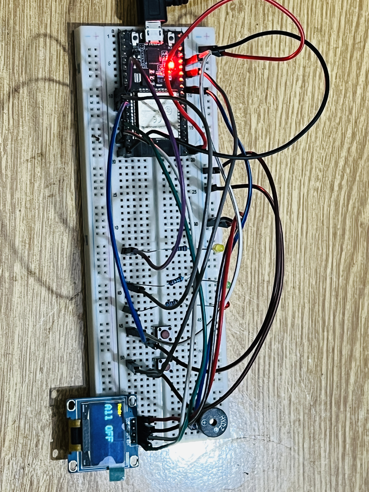
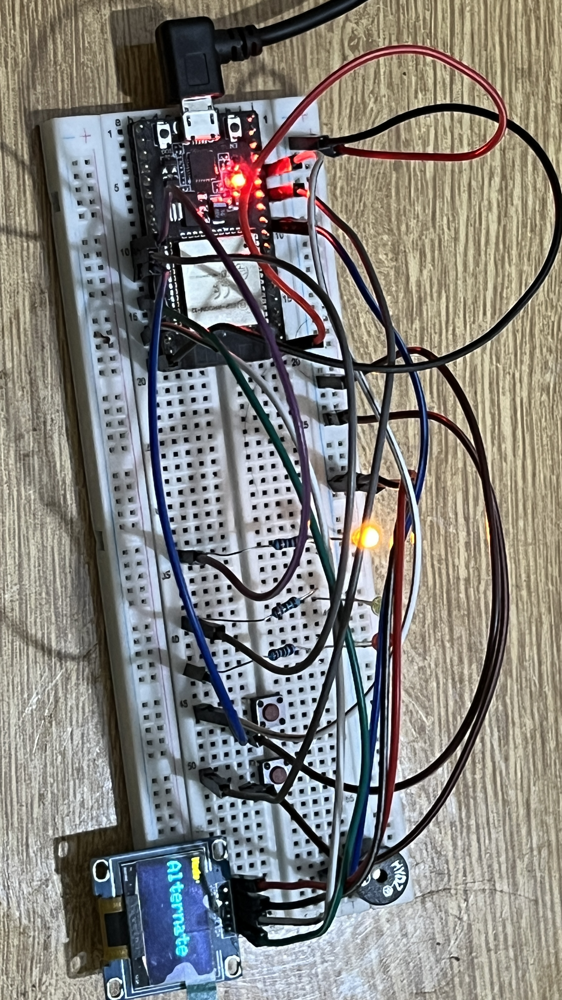
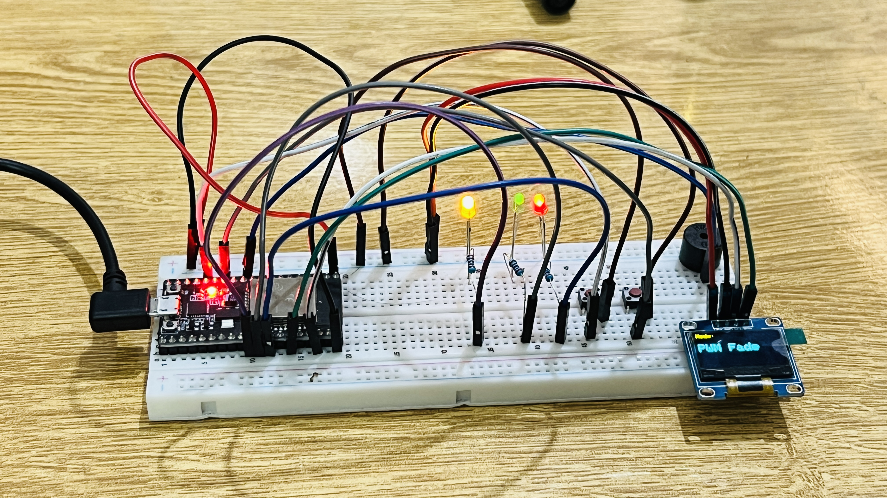
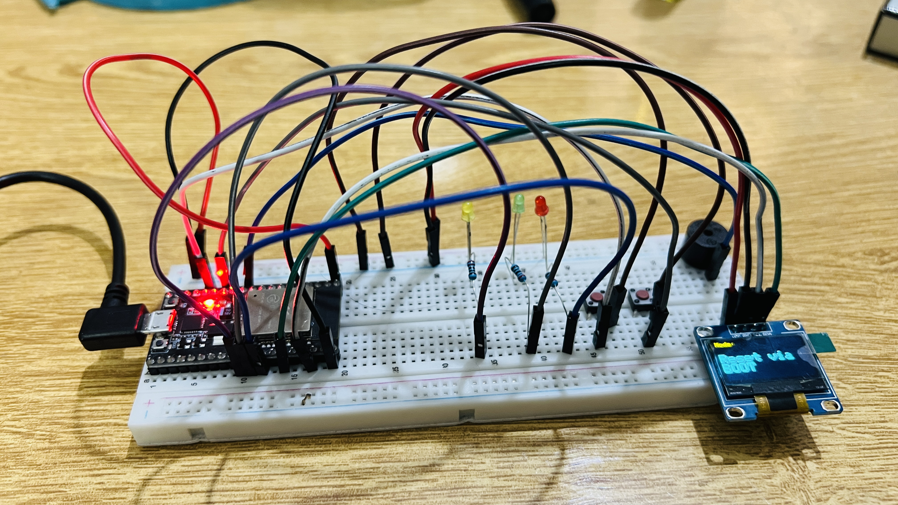

# ESP32 Smart LED Controller with OLED Display and Buzzer

**Author:** Muhammad Umer   
**Registration No:** 23-NTU-CS-1078  
**Course:** Embedded IoT Systems
**Platform:** ESP32 (NodeMCU-32S)  
**Simulation:** Wokwi IoT Simulator  

---

## Project Overview

This project implements a **Smart LED Controller** using the ESP32 microcontroller, featuring:
- **Mode Cycling** through multiple LED behaviors  
- **Action Button** for manual LED control and buzzer activation  
- **BOOT Button** (onboard) to reset the system  
- **OLED Display** for real-time mode and status updates  

The system demonstrates **state-based control**, **PWM LED fading**, and **OLED interfacing** through the **I²C protocol**.  
It also integrates **buzzer control** for user feedback.

---

## Learning Objectives

- Understand **PWM control** for LEDs and buzzers on ESP32.  
- Implement **button debouncing** and **long-press detection** in embedded firmware.  
- Interface an **SSD1306 OLED Display** using the **Adafruit GFX** library.  
- Develop structured, readable, and modular embedded C++ code using Arduino framework.  
- Simulate hardware using **Wokwi Virtual IoT Lab**.

---

## Features Implemented

| Feature | Description |
|----------|--------------|
| **Mode Button** | Cycles through LED modes: OFF → ALTERNATE → ALL ON → PWM FADE |
| **Action Button (Short Press)** | Toggles all LEDs ON/OFF |
| **Action Button (Long Press)** | Triggers buzzer tone for 300 ms |
| **BOOT Button** | Resets all LEDs and returns to OFF mode |
| **OLED Display** | Displays system state (mode / action / reset messages) |
| **PWM LED Control** | Smooth LED fading using sinusoidal waveforms |

---

## Hardware Configuration

| Component | Pin | Description |
|------------|-----|-------------|
| **Red LED** | GPIO 19 | Controlled via PWM Channel 1 |
| **Green LED** | GPIO 18 | Controlled via PWM Channel 2 |
| **Yellow LED** | GPIO 5 | Controlled via PWM Channel 3 |
| **Mode Button** | GPIO 13 | Cycles LED modes |
| **Action Button** | GPIO 12 | Short = Toggle LEDs / Long = Buzzer |
| **BOOT Button** | GPIO 0 | Resets system to OFF mode |
| **Buzzer** | GPIO 27 | PWM audio output |
| **OLED SDA** | GPIO 21 | I²C Data Line |
| **OLED SCL** | GPIO 22 | I²C Clock Line |
| **OLED Address** | 0x3C | SSD1306 I²C address |

---

## Wokwi Simulation

🔗 **[Open Wokwi Project](https://wokwi.com/projects/445755586164651009)**

The Wokwi simulation replicates the complete circuit with:
- 3 LEDs (Red, Green, Yellow)  
- 2 Push Buttons (Mode, Action)  
- 1 Buzzer  
- 1 OLED Display (SSD1306, I²C)  
- ESP32 NodeMCU-32S board  

---

## System Operation Summary

| Mode | Description | OLED Output Example |
|------|--------------|---------------------|
| OFF | All LEDs OFF | “Mode: All OFF” |
| ALTERNATE | LEDs blink in sequence | “Mode: Alternate” |
| ALL ON | All LEDs ON continuously | “Mode: All ON” |
| PWM FADE | LEDs smoothly fade using sine wave | “Mode: PWM Fade” |
| Action (Short Press) | Manual LED toggle | “Action: Short: ALL ON/OFF” |
| Action (Long Press) | Activates buzzer | “Action: Long Press” |
| BOOT Button | Resets system to OFF mode | “Mode: Reset via BOOT” |

---

## Screenshots

| Scenario | Screenshot |
|-----------|-------------|
| System Ready (Initial State) |  |
| Mode: Alternate |  |
| Mode: PWM Fade |  |
| Action: Long Press (Buzzer) | 🎥 [Watch Video](screenshots/long_press.mp4) |
| Reset via BOOT Button |  |

---

## Tools & Libraries

- **Framework:** Arduino for ESP32  
- **Simulation:** [Wokwi ESP32 Simulator](https://wokwi.com)  
- **Libraries Used:**
  - [Adafruit GFX Library](https://github.com/adafruit/Adafruit-GFX-Library)
  - [Adafruit SSD1306 Library](https://github.com/adafruit/Adafruit_SSD1306)
  - `Wire.h` for I²C Communication

---

## References

- ESP32 Datasheet – Espressif Systems  
- Adafruit SSD1306 + GFX Documentation  
- Wokwi Hardware Simulation Reference  

---

## Author’s Note

> This project demonstrates the integration of **embedded control logic**, **PWM techniques**, and **OLED interfacing** on an ESP32 platform.  
> It serves as a foundation for developing interactive IoT and embedded control systems.

---

**© 2025 Muhammad Umer — All Rights Reserved**

